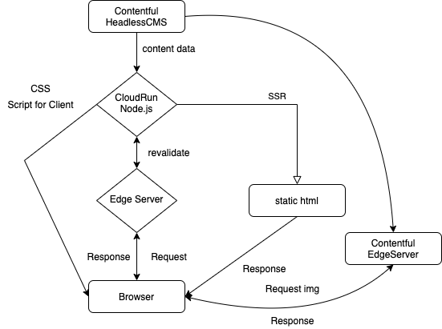
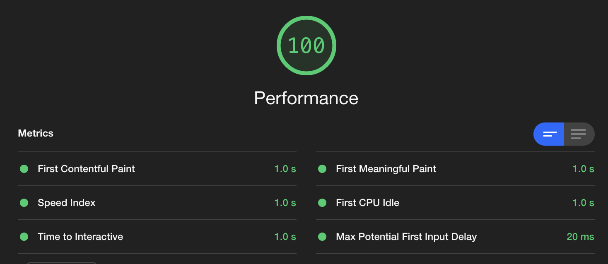
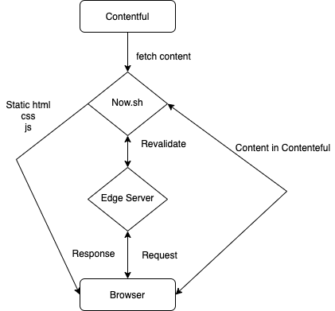
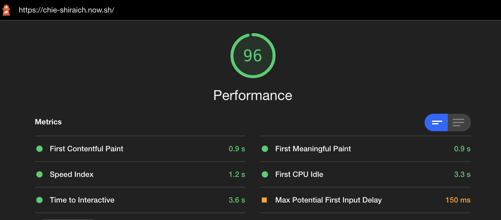
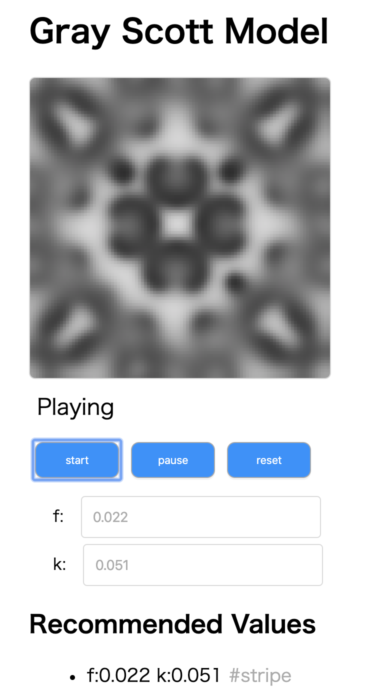

<!-- classes: title -->

# About Me

import { Block } from "../Block";

  <Block content={"name: Shinobu Hayashi (林　仁) aka しにゃい"} />
  <Block content={"Web ( server | browser | edge )-side developer"} />
  <Block content={"Web developer in Nikkei (internship student)"} />
  <Block
    content={
      "A Student in University of Tokyo, majoring in Environmental Engineering and System Theory."
    }
  />

  <ul className="sns">
    <li>Twitter: Shinyaigeek</li>
    <li>GitHub: Shinyaigeek</li>
    <li>Blog: しにゃいの学習帳 https://shinyaigeek.dev</li>
  </ul>
  
  

---

# Interest

- Web Performance
  - of Media web. CDN/Band width in Network/Isomorphic SSR/Cache strategy
  - of Application web. JavaScript Performance/DOM rendering Performance/Isomorphic SSR
- Improvement DX(Develper Experience)
- System Theoritical Visualization, Simulation(eg Fluid mechanics, Self-Organizing model)
- Visualize and Measure and Improvement Performance 
- Web technology and ecosystem

---

## Works

---

# しにゃいの学習帳(My own Tech Blog)

  
  

    <Block
      content={
        "GCP CloudRun/React/JSX(as template)/Sass/Node.js/webpack/TypeScript/Contentful/CloudFlare"
      }
    />
    <Block content={"This System can make web page DYNAMICALLY"} />
    <Block
      content={"TTFB is bottleneck in SSR, but properly Cache strategy can eliminate this problem"}
    />
    
  

---

# (WIP) Illustrator's Portfolio

  
  

    <Block
      content={"Now.sh/React/TypeScript/Sass/Workbox/Contentful/parcel"}
    />
    <Block content={"This System enables non-developper to update website easily"} />
    <Block
      content={"Illustrator's portfolio site is Gallery, so image occupies most of band width.I deel with this problem with CDN and lazy load"}
    />
    
  

---
# Gray Scott Modeling

  
  

    <Block content={"Gray-Scott model is one of the self orgnization model, which is one area of System Theory"} />
    <Block content={"There is a lot of cells, and each cells act and make effects on each other, and then, some pattern will appear as Emergence"} />
  

---

## nptweet
This is command line tool for tweet.

## Finder
This is the system to automate the step that devs keep tech article from feedly to GoogleKeep.
This is running with node.js, now.sh.

---
## And More...(jobs related to Nikkei)

---

## Thank you for listening

